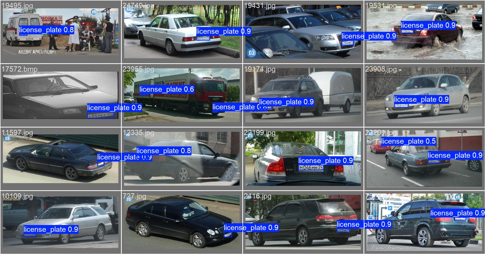

# Система Распознавания Номеров (ANPR) - Этап 1: Детектор номеров

Обучение модели YOLOv8 для локализации (обнаружения) номерных знаков на изображениях.

## Цель этапа

Основной задачей данного этапа было создание быстрой и высокоточной модели, способной находить автомобильные номера на изображениях и возвращать их координаты. Модель является первым и ключевым звеном в нашем ANPR-пайплайне.

По итогам обучения была получена модель качества **production-ready** с показателем `mAP50-95` равным **0.849**.

## Структура проекта

-   `yolotrain.ipynb`: Основной Jupyter Notebook, содержащий весь код для настройки окружения, обучения и валидации модели.
-   `dataset_config.yaml`: Конфигурационный файл, указывающий YOLOv8, где находятся данные для обучения, валидации и тестирования.
-   `yolov8n.pt`: Исходные веса предобученной модели YOLOv8 Nano, которые мы использовали для дообучения (fine-tuning).
-   `runs/detect/yolov8n_plate_detector_local2/`: Папка с результатами эксперимента. Содержит:
    -   `weights/best.pt`: **Главный артефакт.** Веса лучшей модели, показавшей наивысшие метрики на валидационной выборке.
    -   `results.csv`: Таблица с метриками по каждой эпохе.
    -   `results.png`, `confusion_matrix.png` и др.: Графики процесса обучения.
-   `yolo11n.pt`: *(Нерелевантный файл, может быть удален для чистоты проекта)*

## Настройка окружения

Для воспроизведения результатов необходимо настроить изолированное Python-окружение.

1.  **Создайте и активируйте виртуальное окружение:**
    ```bash
    python -m venv venv
    # Windows:
    .\venv\Scripts\activate
    # macOS/Linux:
    source venv/bin/activate
    ```

2.  **Установите зависимости:**
    ```bash
    pip install torch torchvision ultralytics opencv-python matplotlib jupyter
    ```
    **Важно:** Для обучения на GPU убедитесь, что установлена версия PyTorch с поддержкой CUDA. Правильную команду установки можно сгенерировать на [официальном сайте PyTorch](https://pytorch.org/).

## Обучение

1.  **Подготовьте данные:** Распакуйте датасет [Car_plate_detecting_dataset](https://huggingface.co/datasets/AY000554/Car_plate_detecting_dataset) так, чтобы в корне проекта была папка с данными, содержащая подпапки `train`, `val`, `test`.
2.  **Настройте пути:** Откройте `yolotrain.ipynb` и в ячейке "Шаг 1" укажите правильный путь к датасету в переменной `DATASET_BASE_PATH`.
3.  **Запустите ноутбук:** Выполните все ячейки последовательно. Процесс обучения начнется автоматически.

## Результаты

-   **Модель:** YOLOv8n
-   **Количество эпох:** 100
-   **Размер изображений:** 640x640

**Финальные метрики лучшей модели (на 100-й эпохе):**

-   **Точность (Precision):** 0.9753
-   **Полнота (Recall):** 0.9729
-   **mAP_0.5 (грубая точность):** 0.9871
-   **mAP_0.5-0.95 (строгая точность):** **0.8485**

Модель демонстрирует высокую точность и полноту, что гарантирует надежное обнаружение номеров. Отсутствие переобучения подтверждается схожими кривыми ошибок на `train` и `val` выборках.

## Пример



## Следующие шаги

Следующим этапом является **разработка и обучение кастомной OCR-модели** для распознавания текста на изображениях номеров, вырезанных с помощью полученного детектора.